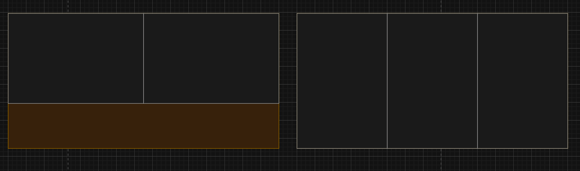
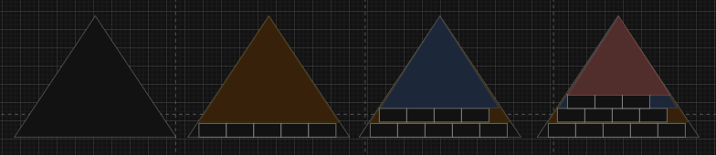

# Desafío de posicionamiento de paneles

## Techo rectangular
La solución para el techo rectángular se encuentra en el archivo `techo.js`, en este se encuentra una función que toma las medidas de largo y ancho del techo y las mismas del panel. Con estas considera cuantos paneles enteros pueden entrar a lo alto y a lo ancho del techo. También evalúa los espacios sobrantes a lo largo y ancho como nuevos techos, rotando su posición 90°.  
La segunda función evalúa cuantos paneles caben tomando el panel en horizontal y en vertical como posición inicial, ya que en algunos casos esto puede comprometer el resultado, como se ilustra el la siguiente imágen con los paneles de 3x2 y el techo de 6x3.  
  

### Notas
El sistema asume que los valores entregados serán válidos, es decir que no habrán elementos con medidas cero, ya que esto plantearía divisiones por cero dentro del código.  

## Techo triangular

Para el techo triangular se plantea una aproximación similar, utilizando un método para encontrar la cantidad de paneles que se pueden posicionar y luego validando cuál es la mejor orientación, estos están en el archivo `triangulo.js`. La función encargada de encontrar el numero de paneles posicionables sigue la siguiente lógica, comienza analizando si el panel cabe dentro del triángulo, luego intenta posicionar una primera hilera de paneles en la base del triángulo. Luego de este cálgulo genera un nuevo triángulo, esta vez restándole la altura de la hilera de paneles añadida. Este proceso se repite hasta que ya no quepan más paneles, en ese momento sale del bucle y retorna la cantidad obtenida. 
  
De esta forma el problema se resuelve el problema descomponiendo los segmentos utilizables del triángulo en rectángulos con la misma altura que los paneles a posicionar.

### Notas
El sisgtema asume que los elementos entregados serán válidos, que el triángulo es isóceles, que el tercer elemento del array que representa el triángulo será la base, que el triangulo es un triangulo posible y que ninguna medida es cero.  

